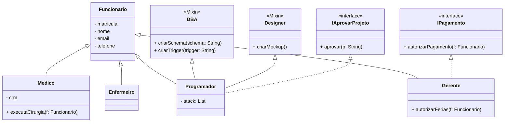

# Exercícios práticos sobre Functions

1. Criar uma função que defina se um valor recebido é primo.

2. Criar uma função de gere um numero da sorte; opcionalmente receber o nome do usuário e o limite(mínimo e máximo) para o número da sorte. A função deve retornar uma mensagem apropriada com base nos parâmetros recebidos.

3. Criar uma função de receba os parâmetros qtd(int) , entrada(double) e atividade (Function); a função deverá receber os parâmetros referidos e executar uma atividade pelo número determinado de vezes conforme a parametrização. Crie pelo menos 2 atividades diversificadas para ser executada.

# Herança, Mixin e Interfaces

